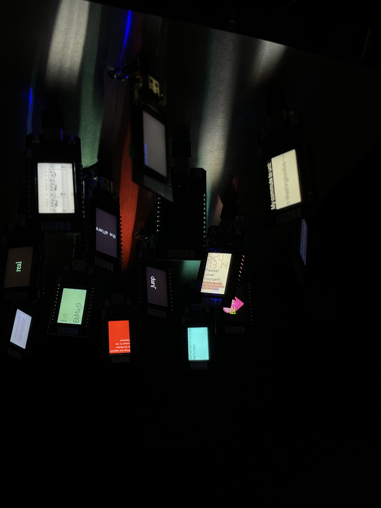
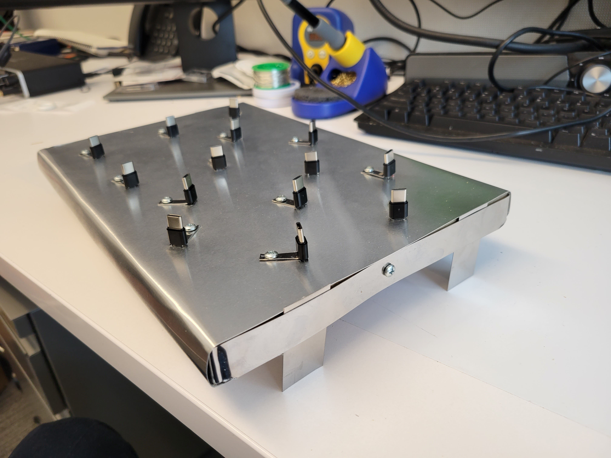
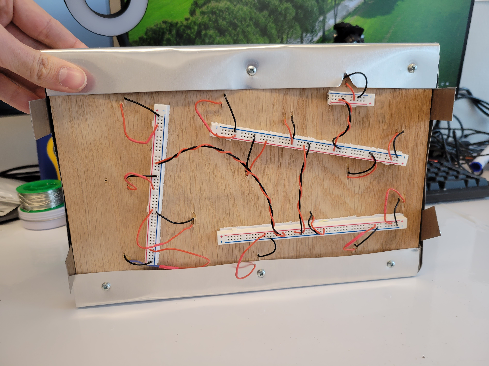
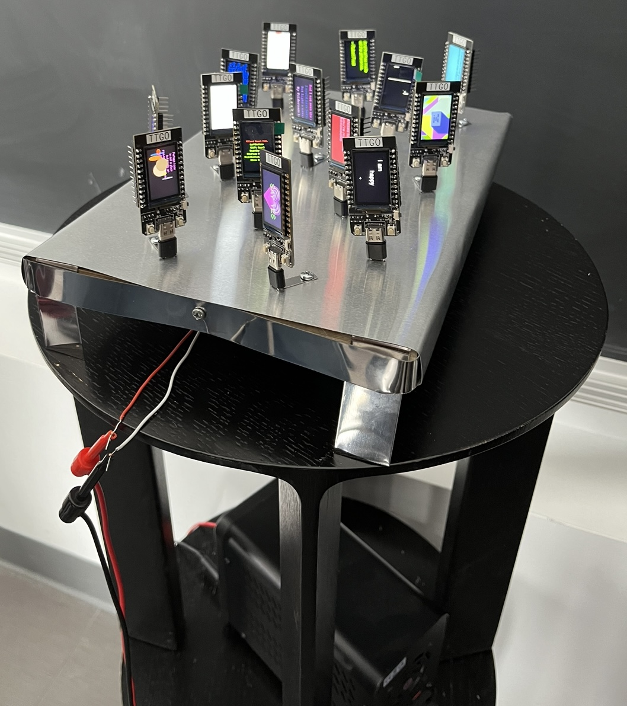
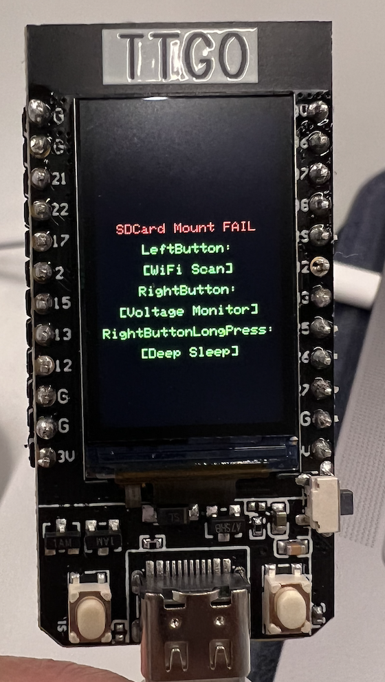
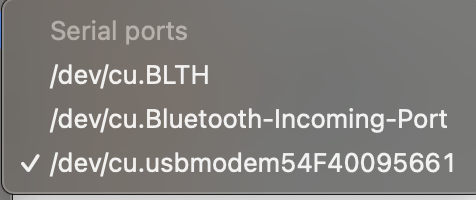

# Dispalying Generative Arts

# How it looks?

(click to view the full video)

In a larger scope:

# Why looks like this?

### Keywords

- **Love**
- **Romantic**
- **Peaceful**
- **Hope**
- **Support**

I used white as the background color to be clean and pure. I put the large digits and the background of the last sentence in pink to show a sense of romance. The digits “520” pronounce similar to “I love you” in Mandarin, and the digits “1314” pronounce similar to the expression of one’s whole lifetime in a poetic way. These digits putting together is a common expression of love for the whole lifetime that Chinese people might use. It is romantic to receive and see this message. I thought of this idea as the valentine’s day just pasted and people who are single or haven’t found loved partners, or even are feeling painful in a relationship should love themselves instead. I put the sentences “Please love yourself”, and “It’s more important than loving anyone else in the world” below the large digits, in order to emphasize that loving oneself is very important and to support people on being their true self and care about themselves more. The words “Please love yourself” is shown subsequently with an exclamation point at the end of each words to express the power and firmness of suggesting people to love themselves whatever they encountered, whatever doubts or difficulties they faced.

# How does it fit in the context?

It accidentally fit well with the surrounding ESP32s, as one nearby ESP32 is displaying a pink large heart shape, with mesaages like “HUG ME”, “TEXT ME”, “I luv U” showing in turn inside the heart. Together with that ESP32, a more romantic and amorous vibe is created. These two ESP32s together is all about love, and aim to give people the hope for love, and romantic expectations for love.

# Guide: How to display visuals on the ESP32 TTGO T-Display

[*Click here to link to the github repository*](https://github.com/Amandaaa00/Generative_Arts)

**Components needed:** ESP32 TTGO T-Display, type-C wire, computer

1. Firstly, download the correct version of Arduino that fit your computer system
2. Open the sketch_love.ino with the Arduino
3. Connect the ESP32 TTGO T-Display to your computer using a type C USB wire
4. On the interface of Arduino, go to Tools → Port, and select the right port that is suitable for your computer, then go to Tools → Board → esp32 and select TTGO T1. In this way, the ESP32 should be connected to the computer
5. Hit the upload button in Arduino, and uplaod the code into esp32. Start seeing the code are being compiled and uploaded to esp32. Then, the screen is able to display the visual message
6. In the class, the professor built a metal platform for us to plug our ESP32s in. The platform can power 14 ESp32s at the same time.

*This is the front of the completely built platform.*

*This is the back of the platform.*

1. After we plugged in our esp32s into the platform, connected the platform to a controllable power supplier and turned on the power, our esp32s started to dispaly the visual messages:
    
    
    
2. This sketch_love program make the esp32 to display visuals as follows: it shows some pink, large digits of “5201314” at first, and then shows the words “Please!”, “Love!”, “Yourself!” in black subsequently, and then it shows a long sentence of black text in pink background saying “It’s more importanat than loving anyone else in the world!”, and then it repeats from the start as only showing the digits.

# Possible Technical Issues

### 1. The Error Message on ESP32:

This error message means that the esp32 can display successfully, but it fails to connect to the computer. 

### 2. The Arduino Problem:

For Mac computer, people might encouter problems to connect ESP32 to the computer. There is a required driver to download to create a special port for the connection.

Some discussions on solving the problem can be found [here](https://github.com/Xinyuan-LilyGO/LilyGo-T-Call-SIM800/issues/139#issuecomment-904390716).

I personally have a Mac with Intel chip, and I solved the problem using the link [here](http://www.wch-ic.com/downloads/CH341SER_MAC_ZIP.html) to download the driver. And then in Arduino, the port as shown below should be selected.

# Notes:
The link to the github repo of this github page is [here](https://github.com/Amandaaa00/Amandaaa00.github.io).
