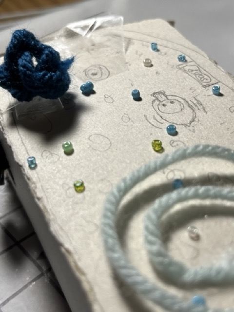
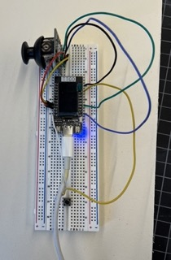
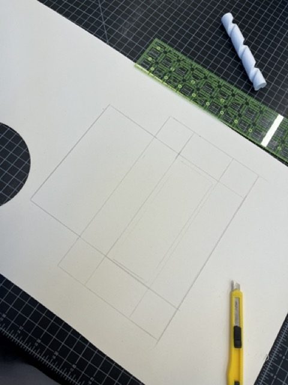
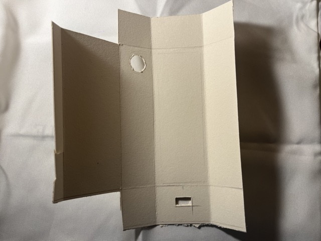
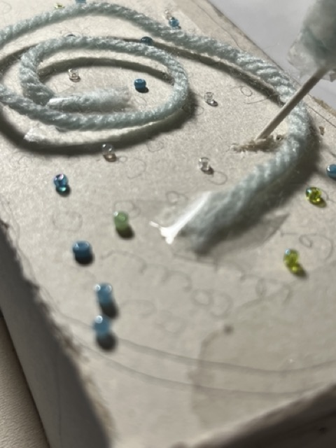
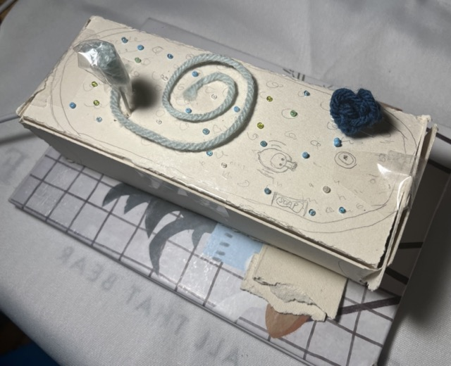

# Playing with Bubbles !!!!

## - *Interacting with Devices*

## How it looks?

[video to be uploaded]

## How to Interact?
- Scroll the joystick to choose a position
- Press the button to release more bubbles
- Press the joystick multiple times to choose a color you like
- Repeat the previous process -- When the bubbles reach the maximum, which is 100, it will start all over again!

[video to be uploaded]

## Visualization on laptop?

[video to be uploaded]

# Why looks like this?

### Keywords

- **Take a rest**
- **Bath**
- **Comfortable**
- **Playful**
- **Colorful**

### Creative elements

- **Design of bath tube**
- **Play with bubbles with different colors**
- **Detailed drawings and decorations**
- **Animation of bubbles colliding and rising**
- **Choice of overall colors: blue, white, pink**

### How to think about it?
Imagine you are lying in the bath tube, enjoying the moment. There are so many bubbles in the bath tube, and you are playing with them, releasing them to the sky and creating more bubbles. You have a little duck toy floating on the water, and a fluffy bath ball to create bubbles. Soft and refreshing music in playing in the background. You are so comfortable and restful, just like going back to a carefree childhood.

### The Process
I used white hard paper as the enclosure as it is white and clear and is also easy to draw and incorporate decorations on it. I tried hard to animate the bubbles movement as realistic as possible. The visualization on laptop starts with relatively realistic animation, as the bubbles are in normal color, and then you can switch them to some random unrealistic colors, such as pink, yellow, purple and etc. I want the user to enjoy the moment of releasing so many bubbles and seeing them colliding each other and moving freely and want to deliver the sense of restfulness and playfulness. 

# Technical Documentations: Interactive Devices

# Guide: How to create an interactive device?

[*Click here to link to the github repository*](https://github.com/Amandaaa00/Interactive-Devices)

**Components needed:** ESP32 TTGO T-Display, a joystick, a button, computer

# Connecting wires
### 1. Connect the ESP32 to the bread board
Simply press the ESP32 into the bread board.
### 2. Connect the joystick
Following the tutorial [here](https://github.com/Freenove/Freenove_Ultimate_Starter_Kit_for_ESP32/blob/master/C/C_Tutorial.pdf) in Chapter 14. 
I connected the GND pin of joystick to G pin of ESP32, the +5V pin of joystick to ESP32's 3V pin, the VRx pin of joystick to ESP32's pin 13, the VRy pin of joystick to ESP32's pin 12, and the SW pin of joystick to ESP32's pin 25.
### 3. Connect the button
Following the previous tutorial again in Chapter 2.
I connected the upper pin of the button to ESP32's 17, and the lower pin of the button to ESP32's another G pin.

*connected bread board*

# Write Arduino code
The Arduino code is written as uploaded in the git repository.
Note that I set the xyz pins into 13, 12, and 25 respectively, just as how I connected the wires. Also, I read the button value from pin 17.
Then the values of x,y,z from the joystick and the value of the button are printed out to the Serial, each followed by a character indicating whhich values it is. And then print a new line character in the end.
From here, we can test whether the joystick, ESP32, and button are connected to the computer correctly and whether interacting with the joystick and button and print their corresponding values on the computer
# Write Processing code
Firstly, we should make sure the value can be passed from the Arduino to the Processing. I used methods of readStringUntil and indexof methods to read the values of xyz and the button separately. The program I wrote can be found in the github repository.
# Use the interactive device
Firstly, connect the ESP32 to the computer and run the Arduino. Then run the Processing code.
Running this program, an animation interface will be created by Processing. Initially, there are 6 bubbles on the screen. They collide with each other freely and rise slowly to the top. When we scroll the joystick to different positions, and then press the button, there will be more bubbles created, which then collide with each other freely and slowly rise to the top. And when the joystick is pressed, the bubbles will change to different colors. Each time the joystick the pressed, the bubbles will all change to a randomly different color. 

The video of running the program and the resulting animation is here.
[to be uploaded]

# Build the enclosure
1. Use hard white paper and cut them into appropriate size.

2. Cut out the contour of the parts of interactive deivices that need to interact with and fold the paper.

3. Stick the connections of the white box
4. Draw the bath tube, water ripples, soap, small toy duck on the water
5. Decorate with woolen yarn and little beads

*decorations*

*detailed drawings*

*overview of the enclosure*

# Possible Technical Issues and Difficulties
### 1. Unstable wire connection
The connection of joystick and button to the breadboard can be unstable, especially for the joystick. I noticed that the value of whether the joystick is pressed is continuously changing when it is not pressed, showing the connection of it is unstable. So in the Processing program, I avoid the function that would check the times or frequency of the joystick is not pressed.
### 2. Simulating the bubbles behavior
It's hard to simulate the bubbles behavior and making it seem realistic. The collide void, and move void are pretty complicated, and all of the bubbles must be in an array in order to deal with their interaction. I referenced some code from the Processing Example, and tried to find the best index of gravity, friction, and spring factors that have influence in the collide and move voids.

# Notes:
The link to the github repo of this github page is [here](https://github.com/Amandaaa00/Amandaaa00.github.io).
